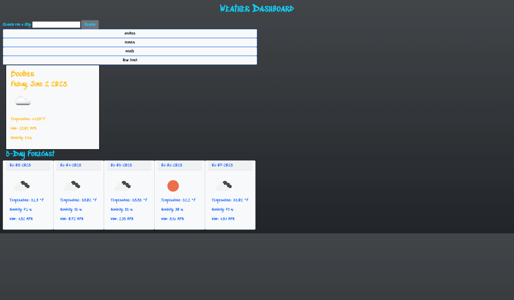

# Weather API Assessment 06

## Description
This application was built with JavaScript and Boostrap along with Day.js to view and search for weather outlooks for the current day and 5 day forecast with an additional
capability to view recently searched cities through localstorage.

## Deployment/Installation

There is no installation required for this website. The webpage can be found by clicking the link below:

[Weather API Assessment 06](https://seropyan1995.github.io/Weather_API_Assessment_06/)

## Built With
This app runs in the browser and features dynamically updated HTML and CSS powered by jQuery.
  * HTML
  * CSS
  * Javascript
  * Bootstrap
  * jQuery
  * day.js
  * GoogleFonts

## API Documentation
[OpenWeather API](https://openweathermap.org/api)

## Demo Image

The following image shows the web application's appearance and functionality:

